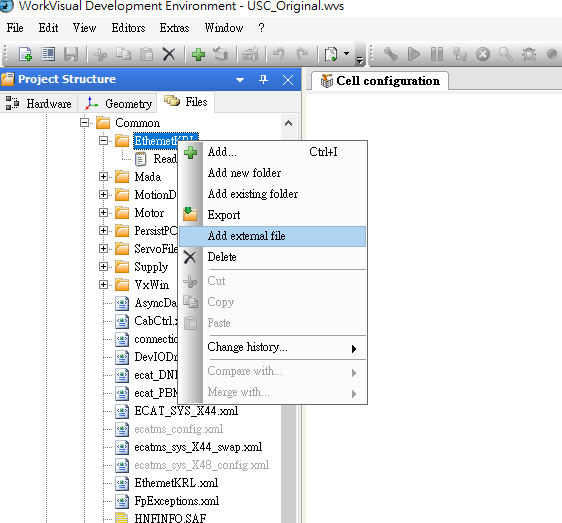
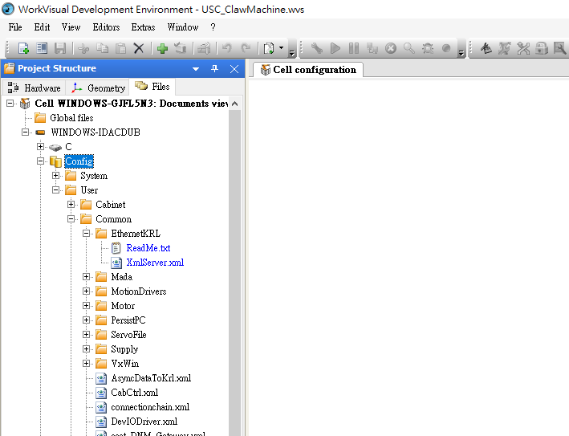
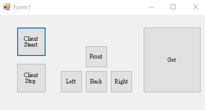

## 四、WtFramework 開發框架
1. WtFramework開發框架介紹
  - WtFramework下載:[enter link description here](https://github.com/yazelin/usc2019-RobotSim/raw/master/src/WtFramework.zip)
  - [KUKA手臂程式](https://github.com/yazelin/usc2019-RobotSim/raw/master/src/KUKAUSC.zip)
  - [架構圖](./src/Wt專案架構圖.pdf)
  - [流程圖](./src/WtFrameworkFlowCharts.pdf)
  - Core
  - Action
2. 安裝
  - 於 WorkVisual 內點選 File/Cataloghandling...
  - 於 Catalogs 視窗點選 KRL Templates 後按 > 按鈕 加入功能
  - 
  - 將 WtFramework.zip 解壓縮後將 KUKA Templates資料夾 覆蓋 C:\Users\User\Documents\KUKA Templates 資料夾
3. 網路通訊
  - EKI [參考文件](http://www.wtech.com.tw/public/download/manual/kuka/krc4/KST-Ethernet-KRL-21-En.pdf)
  - 下載xml檔案:[https://github.com/yazelin/usc2019-RobotSim/raw/masteㄙr/src/XmlServer.zip](https://github.com/yazelin/usc2019-RobotSim/raw/master/src/XmlServer.zip)
  - 在 EthernetKRL 點右鍵選擇 Add external file 加入 Xml.Servver.xml
  - 
  - 點選XmlServer.Xml
  - 
  - Server設定
  
  ```xml
<ETHERNETKRL>
   <CONFIGURATION>
      <EXTERNAL>
         <TYPE>Client</TYPE>			;設定外部Client
      </EXTERNAL>
      <INTERNAL>
         <IP>127.0.0.1</IP>			;設定手臂IP
         <PORT>54600</PORT>				;設定連線串口
         <ALIVE Set_Flag="1"/>			;當確定連線後Flag[1] = TRUE
      </INTERNAL>
   </CONFIGURATION>
   <RECEIVE>
      <XML>
         <ELEMENT Tag="Data/Direction" Type="INT" Set_Flag="2"/>   ;設定接收到的資料 Tag="路徑" Type="資料型別" 接收資料後Flag[2]=TRUE
      </XML>
   </RECEIVE>
   <SEND>
      <XML>
         <ELEMENT Tag="Result/Answer" Type="STRING"/>  ;設定輸出資料
      </XML>
   </SEND>
</ETHERNETKRL>
   ```
 
 4. 練習

5. 夾娃娃機PC端操作介面

  - Winform 介面設計
  - 
  
  - Client 啟動及關閉
  
  ```cs
 		Client client = new Client();
		private void buttonStart_Click(object sender, EventArgs e)
		{
			client.Start("127.0.0.1", 54600);
		}

		private void buttonStop_Click(object sender, EventArgs e)
		{
			client.Stop();
		}
```
  
  - 產生Client類別
  
  ```cs
  namespace ClawMachine
{
	class Client
	{
		TcpClient myClient;         //建立TcpClient

		public Client() { }


		public void Start(string ip, int port)
		{
			if (myClient != null)                   //myClient有資料的話 結束
			{
				return;
			}
			myClient = new TcpClient(ip, port);     //設定Ip跟Port
		}

		public void Stop()
		{
			if (myClient != null)
			{
				myClient.Close();       //關閉Client
				myClient = null;
			}
		}
	}

}
```

  - 建立各項按鈕需傳入資料
  
  ```cs
		private void SetData(string buttonNumber)
		{
			client.Send(buttonNumber);
		}

		private void buttonFront_Click(object sender, EventArgs e)
		{
			SetData("1");
		}

		private void buttonBack_Click(object sender, EventArgs e)
		{
			SetData("2");
		}
		
		private void buttonLeft_Click(object sender, EventArgs e)
		{
			SetData("3");
		}

		private void buttonRight_Click(object sender, EventArgs e)
		{
			SetData("4");
		}

		private void buttonGet_Click(object sender, EventArgs e)
		{
			SetData("5");
		}
  ```
  
  - Client端傳送程式
  
  ```cs
  	private string sendData = string.Empty;

		public void Start(string ip, int port)
		{
			if (myClient != null)                   //myClient有資料的話 結束
			{
				return;
			}
			myClient = new TcpClient(ip, port);     //設定Ip跟Port

			Task.Run(() => ClientService());        //在另一個執行續中執行  ClientService()  ; 由電腦決定是否產生新執行續
		}
		
		public void Send(string data)
		{
			sendData = data;
		}

		private void ClientService()
		{
			while (true)
			{

				try
				{

					if (myClient != null)           //mtClient有連線資料
					{
						StreamReader streamReader = new StreamReader(myClient.GetStream());     //建立StreamReader
						StreamWriter streamWriter = new StreamWriter(myClient.GetStream());     //建立StreamWriter

						while (myClient.Connected)      //mtClient連線
						{
							if (sendData != string.Empty)       //sendData不是空字串
							{
								streamWriter.WriteLine(sendData);       //寫出sendData資料
								streamWriter.Flush();                   //傳送
								Console.WriteLine("Client To Server : " + sendData);

								var data = streamReader.ReadLine();     //讀取Server端傳回資料
								Console.WriteLine("From Server : " + data);

								sendData = string.Empty;
							}
							SpinWait.SpinUntil(() => { return false; }, 10);    //等待0.01秒
						}
					}
				}
				catch (Exception ex)        // 執行try發生錯誤
				{
					Console.WriteLine(ex.ToString());       //印出錯誤訊息
					break;
				}
			}
		}
  ```
  
  - Server端測試程式:[https://github.com/yazelin/usc2019-RobotSim/raw/master/src/WinFormServerTest.zip](https://github.com/yazelin/usc2019-RobotSim/raw/master/src/WinFormServerTest.zip)
  
  - 改寫傳送資料為XML
  ```cs
  	private void SetData(string buttonNumber)
		{
			string dataSend = " ";
			dataSend = "<Data><Direction>"+ buttonNumber +"</Direction></Data>";
			client.Send(dataSend);
		}
  ```
  
  - PC端手臂模擬程式
 <iframe width="560" height="315" src="https://www.youtube.com/embed/W62LbDkruTw" frameborder="0" allow="accelerometer; autoplay; encrypted-media; gyroscope; picture-in-picture" allowfullscreen></iframe>
 
  模擬程式下載: [https://github.com/yazelin/usc2019-RobotSim/raw/master/src/Play.zip](https://github.com/yazelin/usc2019-RobotSim/raw/master/src/Play.zip)  
解壓縮後執行 USC2019RobotSim.exe
  ```
IP 127.0.0.1 
Port 54600
前 <Data><Direction>1</Direction></Data>
後 <Data><Direction>2</Direction></Data>
左 <Data><Direction>3</Direction></Data>
右 <Data><Direction>4</Direction></Data>
夾 <Data><Direction>5</Direction></Data>
  ```
  - 操作介面範例
<!--stackedit_data:
eyJoaXN0b3J5IjpbLTIwNDIyODgxOTUsNDY2OTY1MDkwLDg5OD
c0MzYxMiwtMTI4NjU4MTEyNSwyMTM5MDc3NTUxLDEyMTg2ODk3
ODAsLTEyNjYyNzkxODAsMTM5NTA0ODkzMCwtNzk4MzM1NDIxLD
ExMTg1NTIyNTMsLTEwMDI0NjI5NzksMTQzNDQ5MTAwNSwtNzg3
NTI0NTY3LDIwMTY5Njk1NDksLTE2NTIzNTY2NTksODg4MDUwOD
csMTE0MDQ4NTA4NywtNTY2ODg2OTEzLDE1MzM1NjA5NTcsLTE3
NzIwNzMwNDBdfQ==
-->